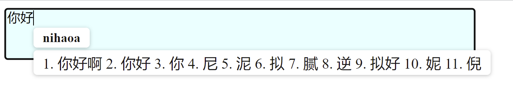

# Simple Online IME
## Feature
- Basic input feature for demo use
- Only support Chinese Pinyin for now
- Leverage APIs from [Goole Input Service](https://www.google.com/inputtools/try/)
## Demo

## Usage
- Run the following command to start server:

    `npm install`
    
    `node server/server.js`

- Access the online IME via:
    
    `http://localhost:2022`